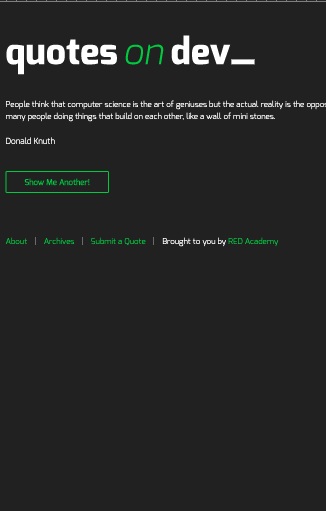

# QuotesOnDev

This is an app to take random quotes from post content on WordPress.

## Development 

+ Download [Wordpress.org](https://wordpress.org/)
+ Create DataBase table on SQL to stored the data provided.
+ Migrate Quotes provided into the DataBase.
+ Style first based on the mobile versio, the scaleted using CSS queries. The quotes incon are only displayed on the desktop verion.
+ Create an AJAX GET request to get the Quotes on the front page. And select one random quote, without reload the page, every time the user click on the botton. This gives the user a better interaction.
+ Create an AJAX POST request to submit new quotes. This option is only avilable for registed users.

##  How to run?

 + `git clone` this project on your `htdocs` folder on MAMP aplication.
 + On the project folder in your terminal install `npm install`. 
 + According to the configuration in gulpFile.js, all the files on `js`and `sass` folder will convert to the min version in `build`folder.
 + Run `gulp`on the terminal, the index.html file will open on the browser.
 + Open on your LocalHost and Log In with your user on Wordpress
 

 
## Final Result

### Phone version

### Tablet version

### Desktop version

 ## Plugins
  + [wp-migrate-db](https://es.wordpress.org/plugins/wp-migrate-db/)
  + [Query Monitor](https://wordpress.org/plugins/query-monitor/)
  + [Contact Form 7](https://wordpress.org/plugins/contact-form-7/): Form used to create new quotes.
  + [WP Migrate DB](https://wordpress.org/plugins/wp-migrate-db/)

 
 ## Sourcer
  + [PHP](https://www.php.net/docs.php)
  + [Ajax for Wordpress](https://codex.wordpress.org/AJAX)
  + [JavaScript Objects](https://www.w3schools.com/js/js_objects.asp)
  + [NPM](https://www.npmjs.com)
  + [Wordpress Documentation](https://developer.wordpress.org/)
  + [Sass](https://sass-lang.com/)
  + [GULP](https://gulpjs.com/)
  + [JQUERY](https://jquery.com/)

  
